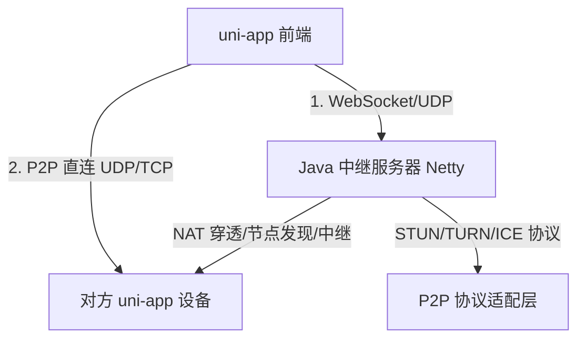

# uni-app + Java 实现 P2P 聊天通讯架构方案


---

## 一、整体架构设计


### 三层结构

1. **前端层**：uni-app（APP/iOS/Android/H5）

2. **服务层**：Java + Netty

3. **P2P 层**：STUN + TURN + ICE 实现 NAT 穿透

---

## 二、推荐技术栈（完全贴合 Java + uni-app）

### 1. 后端（Java 技术栈）

|技术/框架|作用|
|---|---|
|Netty 4.x/5.x|高并发 TCP/UDP 长连接、消息中转|
|JSTUN / OpenNat|NAT 类型检测、端口获取、穿透辅助|
|libjingle（Java 移植）|STUN/TURN/ICE 协议实现|
|JGroups|设备节点发现、组播管理|
### 2. 前端（uni-app）

|技术/插件|作用|
|---|---|
|[uni-socket.io](uni-socket.io)|WebSocket 连接、信令中继|
|uni-app 原生 UDP 插件|APP 端 UDP 直连（P2P 核心）|
|WebRTC|H5/APP 通用 P2P 数据通道|
|uni-p2p（开源插件）/ uni-webrtc-p2p（开源封装）|开源免费、适配uni-app全端，内置STUN打洞逻辑，可自定义扩展，降低P2P开发量，社区持续维护|
### 3. P2P 协议选型（替代自研 FRP/TOR）

|协议|用途|
|---|---|
|STUN|获取公网 IP:Port，实现 NAT 穿透|
|TURN|P2P 打洞失败时的兜底中继|
|ICE|自动选择最优链路（直连优先，失败走中继）|
|QUIC|低延迟、弱网友好的 P2P 传输|
---

## 三、分步落地路线

### 步骤 1：先做中继通讯（1～2 周可上线）

**架构**：uni-app <-> Netty <-> uni-app

#### 后端（Netty WebSocket 核心）

```Java

public class WebSocketServerHandler extends SimpleChannelInboundHandler<TextWebSocketFrame> {
    private static final Map<String, Channel> DEVICE_CHANNELS = new ConcurrentHashMap<>();

    @Override
    protected void channelRead0(ChannelHandlerContext ctx, TextWebSocketFrame msg) {
        JSONObject obj = JSON.parseObject(msg.text());
        String to = obj.getString("to");
        Channel target = DEVICE_CHANNELS.get(to);
        if (target != null && target.isActive()) {
            target.writeAndFlush(new TextWebSocketFrame(msg.text()));
        }
    }

    @Override
    public void handlerAdded(ChannelHandlerContext ctx) {
        String deviceId = ctx.channel().attr(AttributeKey.valueOf("deviceId")).get();
        DEVICE_CHANNELS.put(deviceId, ctx.channel());
    }
}
```

#### 前端（uni-app 连接）

```JavaScript

import io from '@/components/uni-socket.io/uni-socket.io.js';
const socket = io('ws://host:port');

socket.on('connect', () => {
  socket.emit('register', { deviceId: '我的ID' });
});

// 发送点对点消息
function sendTo(toDeviceId, content) {
  socket.emit('msg', { from: '我', to: toDeviceId, content });
}

// 接收消息
socket.on('msg', (data) => {
  console.log('收到：', data);
});
```

---

### 步骤 2：升级 P2P 直连（2～4 周）

1. 后端部署 **STUN 服务**（JSTUN）

2. 前端获取自身公网 IP:Port

3. 通过信令服务器交换地址

4. 两端尝试 **UDP 打洞直连**

5. 直连成功：消息不走服务器

6. 直连失败：自动 fallback 回中继

---

### 步骤 3：进阶能力（FRP / TOR / L2P 风格）

- **类 FRP 内网穿透**：使用 Java 版 FRP Client，做端口映射、公网暴露

- **类 TOR 匿名路由**：集成 jTor，做多层转发（隐私通讯）

- **类 L2P 局域网直连**：本地 UDP 广播发现 + 公网穿透

- **弱网优化**：Netty + QUIC 替代 TCP

---

## 四、关键结论（最精简版）

1. **你不用换技术栈**：Java + Netty 完全能做高性能 P2P

2. **uni-app 完美适配**：WebSocket + WebRTC + UDP 插件

3. **不用自研 FRP/TOR**：直接用 STUN/TURN/ICE 最稳

4. **落地路径**：

    - 先做中继聊天

    - 再加 P2P 直连

    - 最后上穿透/匿名

---

如果你需要，我可以直接给你：

- 完整版 **Netty STUN 服务器代码**

- **uni-app P2P 直连 Demo**

- 一套 **可直接上线的聊天架构文档**
> （注：文档部分内容可能由 AI 生成）
